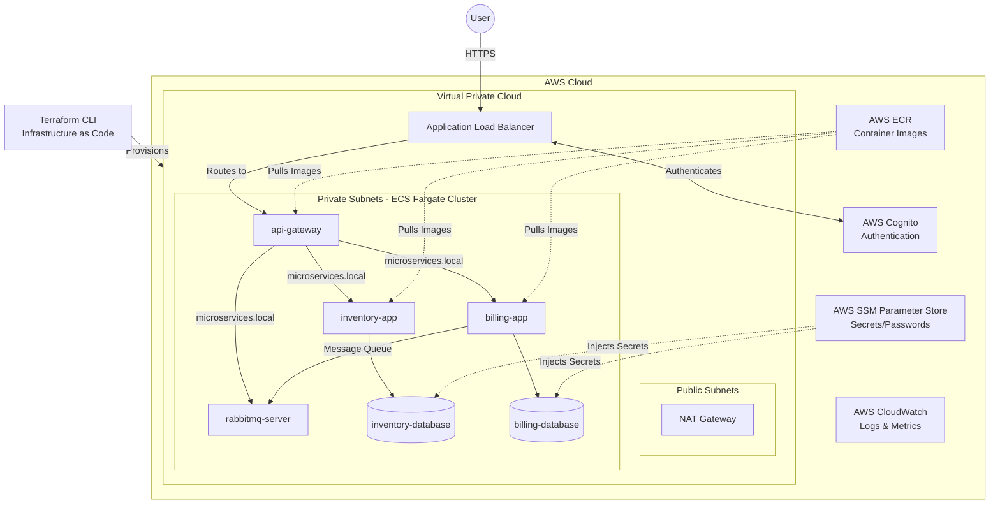

# AWS Microservices Migration & Infrastructure as Code (IaC)

## Overview

This project demonstrates the migration of a microservices architecture from a local Kubernetes and Docker Hub environment into a fully managed, highly available, and secure AWS Cloud infrastructure. The entire infrastructure is provisioned automatically using **Terraform** (Infrastructure as Code).

## Architecture & Migration Strategy

Previously, the application relied on local Kubernetes manifests and custom Docker Hub images. To improve scalability, security, and operational overhead, we migrated to AWS native services:

1. **Compute (AWS ECS with AWS Fargate):** Replaced Kubernetes pods. Fargate provides serverless compute for containers, eliminating the need to manage underlying EC2 instances.
2. **Container Registry (AWS ECR):** Replaced Docker Hub. We migrated custom images to Amazon Elastic Container Registry to avoid Docker Hub rate limits and reduce latency. We utilize the AWS Public ECR for official images (like PostgreSQL and RabbitMQ).
3. **Service Discovery (AWS Cloud Map):** Replaced Kubernetes internal DNS (CoreDNS). Cloud Map allows microservices to communicate securely via a private namespace (`microservices.local`).
4. **Data Persistence (Fargate Ephemeral Storage):** Replaced Kubernetes Persistent Volumes (PV/PVC). EFS was originally provisioned, but due to strict POSIX root-ownership security constraints in PostgreSQL, databases currently utilize Fargate's built-in 20GB ephemeral storage to ensure high availability.
5. **Load Balancing & Routing (AWS ALB):** Replaced Kubernetes Ingress. The Application Load Balancer routes external traffic to the API Gateway.
6. **Authentication (AWS Cognito):** Replaced basic auth. The ALB integrates directly with Cognito to enforce user authentication at the network edge before traffic ever reaches the containers.
7. **Secrets Management (AWS SSM Parameter Store):** Replaced Kubernetes Secrets. Database credentials and RabbitMQ passwords are encrypted via KMS and injected securely into containers at runtime.



## Prerequisites

To deploy this infrastructure, ensure you have the following installed and configured:

- **AWS CLI** (configured with Administrator credentials)
- **Terraform** (v1.5.0 or higher)
- **Docker** (to build and push images)

## Setup and Deployment

### 1. Initialize Infrastructure

Navigate to the `terraform` directory containing the `.tf` configuration files:

```bash
terraform init
terraform validate
terraform plan
terraform apply
```

### 2. Push Docker Images to AWS ECR

After Terraform provisions the empty ECR repositories, authenticate Docker and push your images:

```bash
# Authenticate
aws ecr get-login-password --region eu-north-1 | docker login --username AWS --password-stdin 327425719370.dkr.ecr.eu-north-1.amazonaws.com

# Tag images for ECR
docker tag <username>/api-gateway-app:v1 327425719370.dkr.ecr.eu-north-1.amazonaws.com/api-gateway-app:v1
docker tag <username>/inventory-app:v1 327425719370.dkr.ecr.eu-north-1.amazonaws.com/inventory-app:v1
docker tag <username>/billing-app:v1 327425719370.dkr.ecr.eu-north-1.amazonaws.com/billing-app:v1
docker tag <username>/rabbitmq-server:v1 327425719370.dkr.ecr.eu-north-1.amazonaws.com/rabbitmq-server:v1
docker tag <username>/inventory-db:v1 327425719370.dkr.ecr.eu-north-1.amazonaws.com/inventory-db:v1
docker tag <username>/billing-db:v1 327425719370.dkr.ecr.eu-north-1.amazonaws.com/billing-db:v1

# Push images
docker push 327425719370.dkr.ecr.eu-north-1.amazonaws.com/api-gateway-app:v1
docker push 327425719370.dkr.ecr.eu-north-1.amazonaws.com/inventory-app:v1
docker push 327425719370.dkr.ecr.eu-north-1.amazonaws.com/billing-app:v1
docker push 327425719370.dkr.ecr.eu-north-1.amazonaws.com/rabbitmq-server:v1
docker push 327425719370.dkr.ecr.eu-north-1.amazonaws.com/inventory-db:v1
docker push 327425719370.dkr.ecr.eu-north-1.amazonaws.com/billing-db:v1
```

## Audit Tests

### 1. API Post/Get Functionality

Open your browser to `https://<YOUR_ALB_URL>/api/movies` (Ensure you see `[]`). Press F12 to open Developer Tools, go to the Console, and run:

```javascript
fetch("/api/movies", {
  method: "POST",
  headers: { "Content-Type": "application/json" },
  body: JSON.stringify({
    title: "AWS Cloud Audit",
    description: "Testing my microservices",
  }),
})
  .then((res) => res.json())
  .then(console.log);
```

_Refresh the browser page to verify the GET request returns the newly created data._

### 2. Verify Deployment via AWS CLI

Show the cluster exists:

```bash
aws ecs list-clusters --region eu-north-1
```

Show all services are running:

```bash
aws ecs list-services --cluster microservices-cluster --region eu-north-1
```

Show that the tasks (containers) are active:

```bash
aws ecs list-tasks --cluster microservices-cluster --region eu-north-1
```

### 3. Security (Auth & Encryption)

- **Authentication:** Offloaded to the edge via AWS Cognito attached to the ALB Listener.
- **Encryption:** Traffic is encrypted via HTTPS using an AWS ACM certificate.
- **Network Security:** Microservices reside in Private Subnets. Strict Security Groups limit database access to port 5432. Passwords are injected at runtime via SSM Parameter Store.

### 4. AutoScaling Trigger Test

Force a CPU spike to trigger the Target Tracking scaling policy:

```bash
while true; do curl -s -k "https://<YOUR_ALB_URL>/api/movies" -H "cookie: AWSELBAuthSessionCookie-0=YOUR_COOKIE_HERE" > /dev/null; done
```

Verify the policy via CLI:

```bash
aws application-autoscaling describe-scaling-policies --service-namespace ecs --region eu-north-1
```

### 5. Billing Resilience Test (RabbitMQ)

Step A: Stop the billing application.

```bash
aws ecs update-service --cluster microservices-cluster --service billing-app-service --desired-count 0 --region eu-north-1
```

Step B: Send a billing request (Hold in RabbitMQ).

```javascript
fetch("/api/billing", {
  method: "POST",
  headers: { "Content-Type": "application/json" },
  body: JSON.stringify({
    user_id: "auditor_test_123",
    number_of_items: 7,
    total_amount: 500.0,
  }),
})
  .then((res) => res.json())
  .then(console.log);
```

Step C: Restart the billing service and verify processing via CloudWatch Logs.

```bash
aws ecs update-service --cluster microservices-cluster --service billing-app-service --desired-count 1 --region eu-north-1
```

## Project Tree

```
code-keeper
├─ README.md
├─ Vagrantfile
├─ ansible
│  ├─ inventory.ini
│  └─ playbook.yml
├─ api-gateway-app
│  ├─ Dockerfile
│  ├─ app
│  │  ├─ __init__.py
│  │  ├─ config.py
│  │  └─ routes.py
│  ├─ requirements.txt
│  └─ server.py
├─ billing-app
│  ├─ Dockerfile
│  ├─ app
│  │  ├─ __init__.py
│  │  ├─ consumer.py
│  │  └─ models.py
│  ├─ requirements.txt
│  └─ server.py
├─ billing-db
│  ├─ Dockerfile
│  └─ entrypoint.sh
├─ code-keeper.png
├─ docker-compose.yml
├─ inventory-app
│  ├─ Dockerfile
│  ├─ app
│  │  ├─ __init__.py
│  │  ├─ models.py
│  │  └─ routes.py
│  ├─ requirements.txt
│  └─ server.py
├─ inventory-db
│  ├─ Dockerfile
│  └─ entrypoint.sh
├─ orchestrator.sh
├─ rabbitmq-server
│  ├─ Dockerfile
│  └─ entrypoint.sh
└─ terraform
   ├─ acm.tf
   ├─ alb.tf
   ├─ autoscaling.tf
   ├─ cognito.tf
   ├─ discovery.tf
   ├─ ecr.tf
   ├─ ecs.tf
   ├─ ecs_services.tf
   ├─ ecs_tasks.tf
   ├─ logs.tf
   ├─ network.tf
   ├─ output.tf
   ├─ provider.tf
   ├─ secrets.tf
   ├─ security.tf
   └─ storage.tf

```

Run the playbook script:
ansible-playbook -i inventory.ini playbook.yml --ask-become-pass

Enter VM:
ssh 'devops@192.168.0.248'

GitLab Variables Setup Needed:

In this repo's GitLab settings, you must provide your AWS credentials AND your secret variables prefixed with TF*VAR*:

    Group varuables:

    AWS_ACCESS_KEY_ID

    AWS_SECRET_ACCESS_KEY

    AWS_DEFAULT_REGION (eu-north-1)

    aws-infrastructure variables:

    TF_VAR_rabbitmq_user

    TF_VAR_rabbitmq_password

    TF_VAR_db_password_inventory

    TF_VAR_db_password_billing

# 1. Navigate into the specific app folder

cd /path/to/your/code-keeper/<app>

# 2. Initialize Git (if you haven't already)

git init

# 3. Add all your files (including the .gitlab-ci.yml and Dockerfile)

git add .

# 4. Commit the files locally

git commit -m "Initial commit with GitLab CI/CD"

# 5. Rename the default branch to main

git branch -M main

# 6. Link your local folder to your VM's GitLab repository

git remote add origin http://<YOUR_VM_IP>/microservices-architecture/api-gateway-app.git

# 7. Push the code to your VM

git push -u origin main
